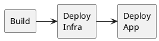
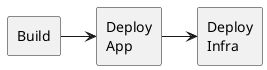
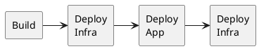
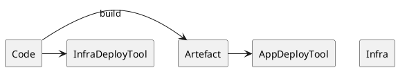

There is a difficulty that arises, I have noted, when a distinct tool or pipeline step is used to deploy application code compared to deploying infrastructure.

If we are doing infra-structure-as-code or GitOps it is likely we have our infrastructure in the same repository as the application that runs on it. It is also likely we deploy that infrastructure via Terraform or a vendor-specific tool like AWS Cloudformation.

However, teams may choose to do _application_ deployment on that infrastructure via `kubectl` in the case of Kubernetes. Maybe we have a serverless application that we deploy via a framework's own CLI tool.

## The Sandwich

So we likely need a deployment pipeline that looks roughly like:

However if we take the Kubernetes use case, we the "App" deployment will include things like ingress. If we have used the ALB Controller to create an AWS load balancer, we can't deploy any infra attached to that until after it is created. Therefore maybe we want:

But this is clearly wrong if we want to provision infrastructure the app needs like a Redis cache or database before the application is deployed.

So the "Infrastructure Sandwich" emerges as a naive solution to the problem:

That is, we have two deployments for infrastructure. Firstly we deploy the base infrastructure needed for the application, then the application and finally we can deploy additional infra like alarms or logging that rely on knowing things created by the application stage.

## The Problem

The most obvious problem is that the pipeline above just looks clunky. It doesn't seem elegant to have this sandwich of deployment steps and that inelegance is telling us something about our design and abstractions, I think.

A more tangible issue is we have lost potential atomicity of our deployments. That is, if we deploy everything through a single AWS Cloudformation update (a feature of AWS SAM) then Cloudformation handles:

1. Making the change appear as a single operation
2. Doing internal steps in an appropriate order to avoid bad state
3. Halting and rolling back the transaction if an unexpected error occurs

Tools like Terraform do not tend to roll back as such, but there is an atomicity of the "plan" phase where we have old state, desired new state and it plans all the steps to get from one to another in a single operation from the perspective of the caller.

## But people don't always notice it

There's a particular tricky aspect to this problem that makes it hard to notice it. In fact, reading this you may be thinking this isn't a big problem or an edge case. One of the things that hides this problem is if we build a pipeline like the first one above:

as a first pass. That is perfectly sufficient to bootstrap base infra (EC2, Kubernetes) and deploy to it. Then later we can add databases, caches, etc. and it will work. And then one day we add an alarm attached to a load balancer, say, and _it will work_.

The truth is if applying deltas to existing infrastructure, we can easily attach stuff to existing load balancers and other things owned by the "app" deployment phase because those things in place.

But can you redeploy all this from scratch in case of disaster recovery?

What will happen if all the infra is lost and we run `terraform plan` for the first time, it will abort because it's trying to attach infrastructure to things that do not exist yet.

This is such a hard thing to notice and get right but I have seen countless cases where infra-as-code and continuous deployment is reliant on the fact we haven't ever actually torn it all down and verified it will all come back up without some chicken-and-egg paradox.

## Causes

There's a few places I have seen this arise:

1. Where Kubernetes is used on a cloud vendor and you want to let it create _some_ infra like ingress (and AWS ALB vis the ALB controller) but you want to attach alarms to that ALB.
2. Where an internal platform tool was used to create Amazon Machine Images (AMI) and upload them to an existing AWS Autoscaling Group (ASG). The presumption was you had handled an infra deployment phase beforehand.
3. Any case where deployment is a little bit more manual, e.g. I create infra, deploy via git, FTP, SCP, then add some more infra. In these cases it's normally so manual people don't even have a pipeline in which the sandwich appears.
4. Cases where a serverless framework (e.g. serverless) is used where it has built-in deployment commands that are limited to creating the function and uploading the latest code. In these cases we still need infra deployments either side.

## Solution

While the two-phase infra deployment will do it, it's hinting we have our abstraction wrong. In my mind this is where encapsulation comes in. The naive pipelines above are based on a domain model along the lines of:

